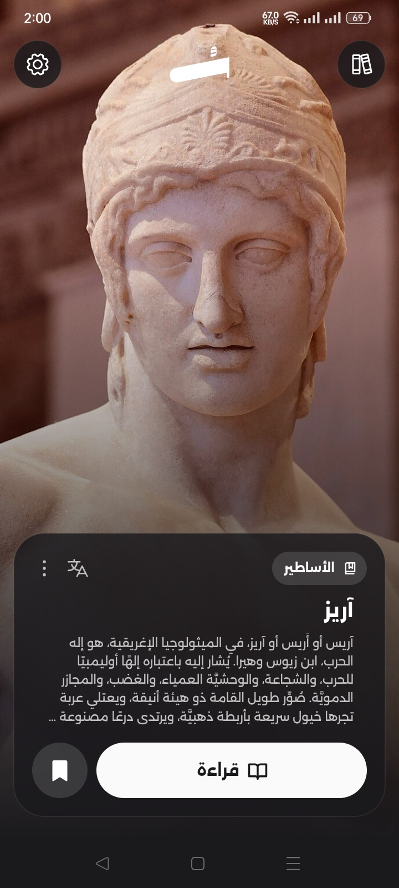
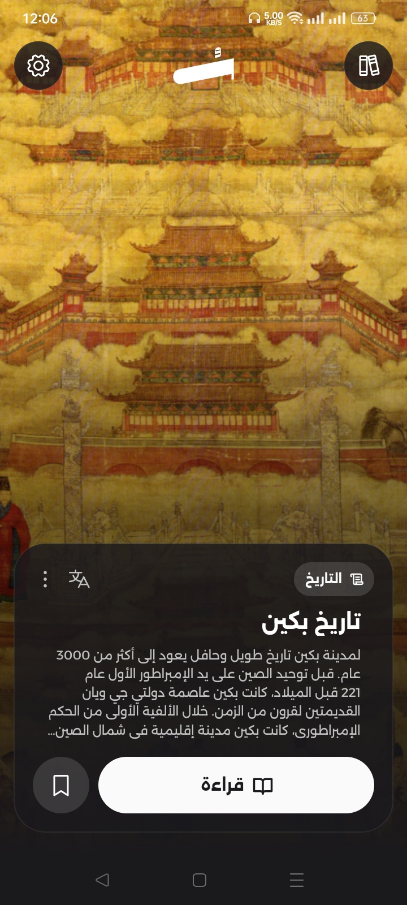
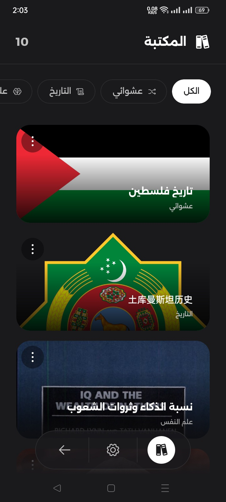
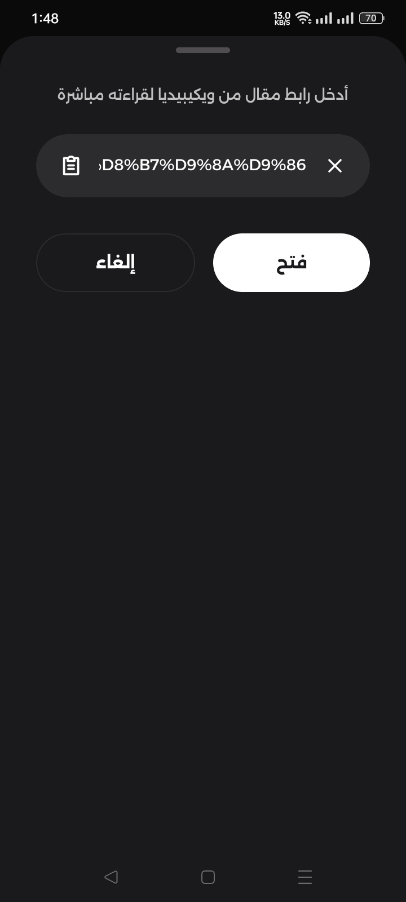
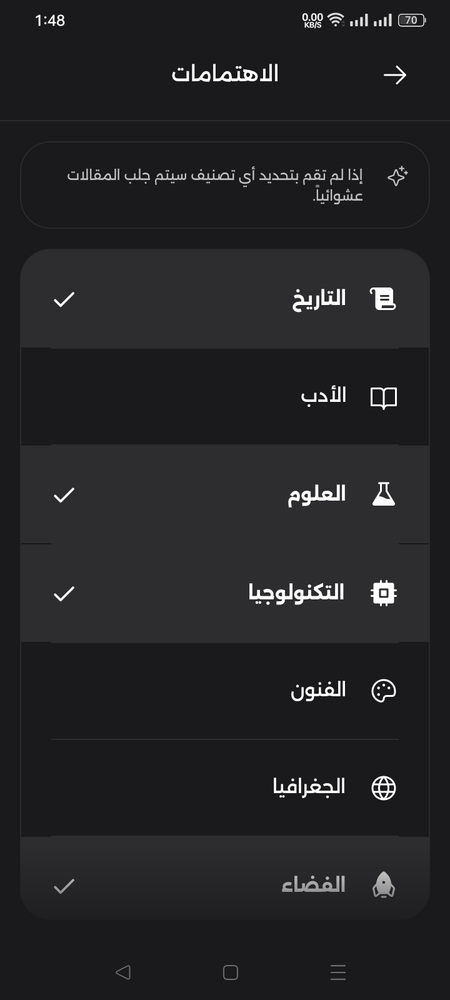
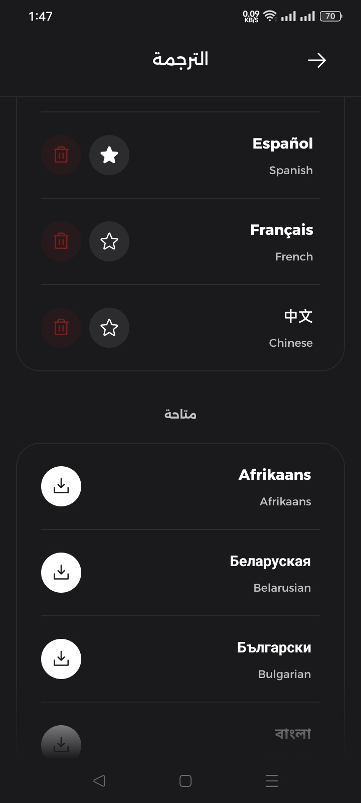
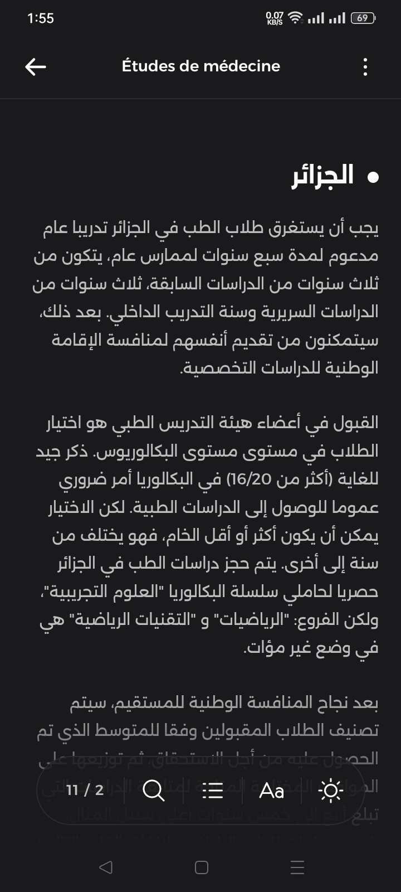
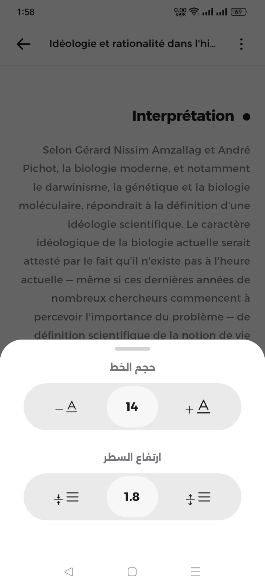
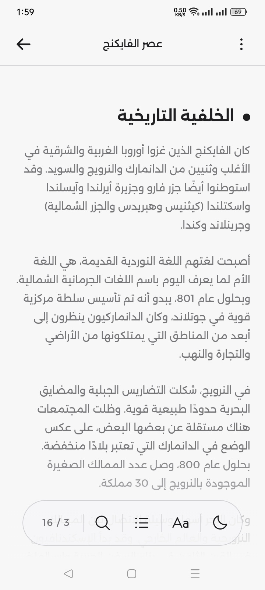

# Soma

**تطبيق لقراءة وعرض مقالات ويكيبيديا بأسلوب الريلز، مع أدوات قراءة متقدمة ودعم كامل للترجمة بدون إنترنت**

 

<a href="README.md">English</a>
&nbsp;-&nbsp;
<a href="README-es.md">Español</a>
&nbsp;-&nbsp;
العربية

 

 

 

## 👀 لقطات الشاشة

  
  
  
  
  
  
  
  
  

 

## ✨ المميزات

* تصفح واكتشف مقالات ويكيبيديا بأسلوب تمرير رأسي عصري (Reels).
* اقرأ عبر واجهة مريحة ومنظمة تدعم التمرير الأفقي للتنقل السريع بين العناوين الرئيسية.
* تحكم في تجربة القراءة من خلال تعديل حجم الخط وارتفاع الأسطر، والبحث داخل المقال، والتنقل عبر الفهرس، والتبديل بين المظهر الفاتح والداكن.
* احفظ المقالات محلياً على جهازك للرجوع إليها وقراءتها في أي وقت بدون إنترنت.
* ترجم المقالات إلى أكثر من 55 لغة محلياً على جهازك بالكامل بدون الحاجة للاتصال بالإنترنت.
* تصفح واقرأ مقالات ويكيبيديا بأكثر من 30 لغة مختلفة.
* حدد اهتماماتك وتصنيفاتك المفضلة للحصول على مقالات مخصصة تناسب تفضيلاتك.
افتح واقرأ أي مقال من ويكيبيديا مباشرة داخل التطبيق عبر أداة قراءة الروابط المخصصة.
* استعرض الصور بدقة كاملة أو افتح المقال في المتصفح الخارجي أو شاركه بسهولة.

 

## 🔽 التحميل

يمكنك تحميل أحدث إصدار من التطبيق عبر صفحة [الإصدارات (Releases)](https://github.com/you0ssef/SomaApp/releases)

> [!TIP]
> إذا لم تكن متأكداً من الإصدار المتوافق مع جهازك، يُرجى تحميل إصدار **Universal** بصيغة APK، فهو يعمل على جميع الأجهزة المدعومة

 

## 🐛 الإبلاغ عن الأخطاء والاقتراحات

هل واجهت مشكلة أو لديك اقتراح لتحسين التطبيق؟ يُرجى فتح **[تذكرة جديدة (Issue)](https://github.com/you0ssef/SomaApp/issues)**

 

## 📃 الترخيص

تطبيق سوما مجاني للاستخدام. جميع الحقوق محفوظة ©
