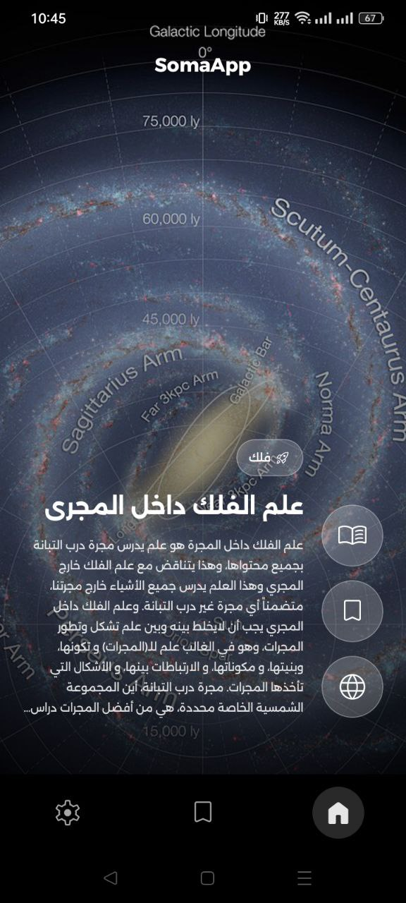
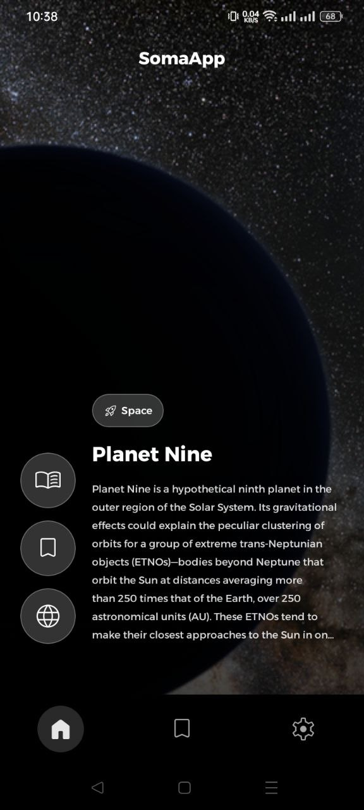
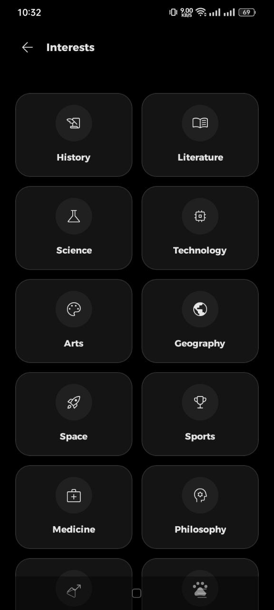
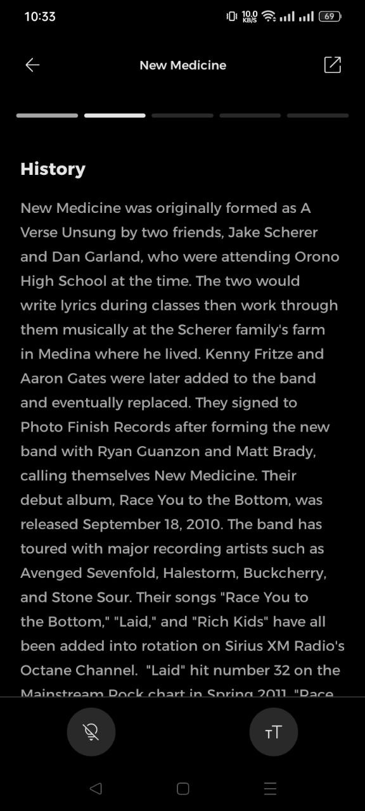
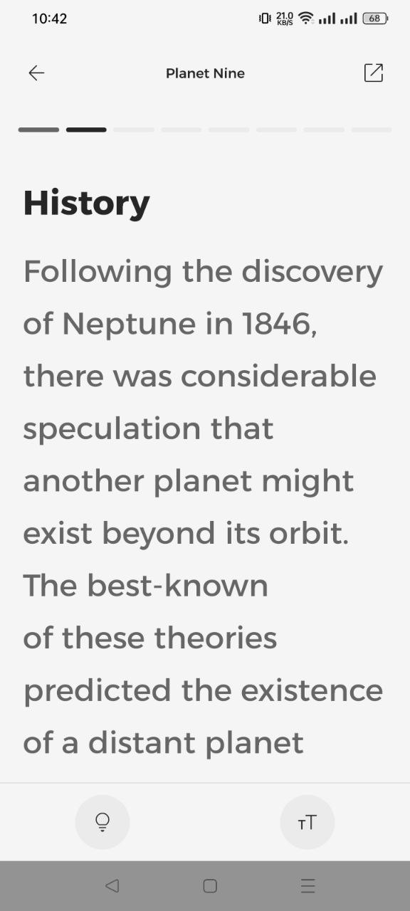
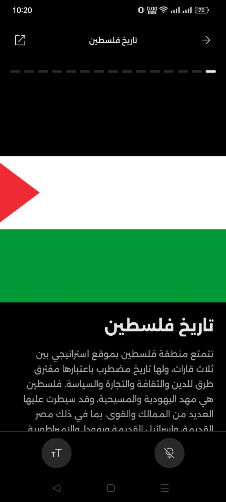

# Soma

<a href="README.md">English</a>
&nbsp;&nbsp;
Español
&nbsp;&nbsp;
<a href="README-ar.md">العربية</a>

 

 

 

## 👀 Capturas de pantalla

  
  
  
  
  
  
  
  
  

 

## ✨ Características

* Explora artículos de Wikipedia en un formato moderno de desplazamiento vertical (Reels)
* Configura tus intereses para recibir artículos adaptados a tus preferencias
* Guarda artículos localmente para leerlos en cualquier momento sin conexión a internet
* Una interfaz de lectura limpia y organizada para un mejor enfoque
* Personaliza tu experiencia ajustando el tamaño de fuente y cambiando entre temas claro/oscuro
* Copia enlaces de artículos fácilmente o ábrelos en un navegador externo
* Disponible en varios idiomas, con más en camino

 

## 🔽 Descargar

Puedes descargar la última versión de la aplicación desde la página de [Releases](https://github.com/you0ssef/SomaApp/releases)

> [!TIP]
> Si no estás seguro de qué versión es compatible con tu dispositivo, descarga el APK **Universal**, ya que funciona en todos los dispositivos compatibles.

 

## 🐛 Reporte de Errores y Sugerencias

¿Encontraste un error o tienes una sugerencia? Por favor, abre un **[Issue](https://github.com/you0ssef/SomaApp/issues)**

 

## 📃 Licencia

Soma es una aplicación de uso gratuito. Todos los derechos reservados ©
