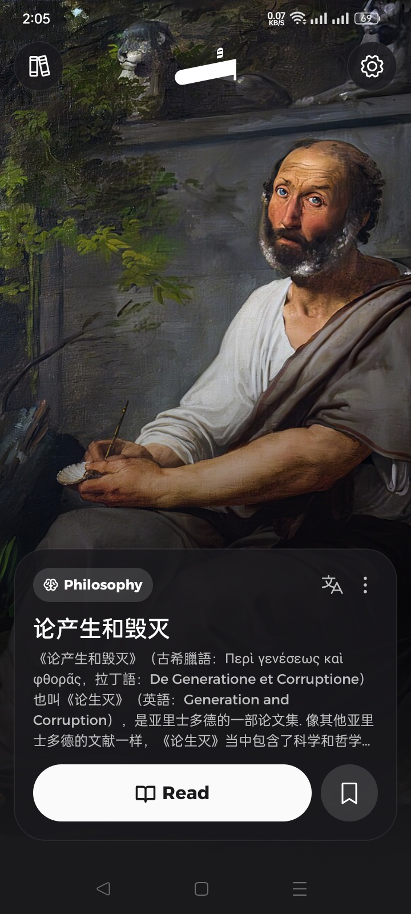
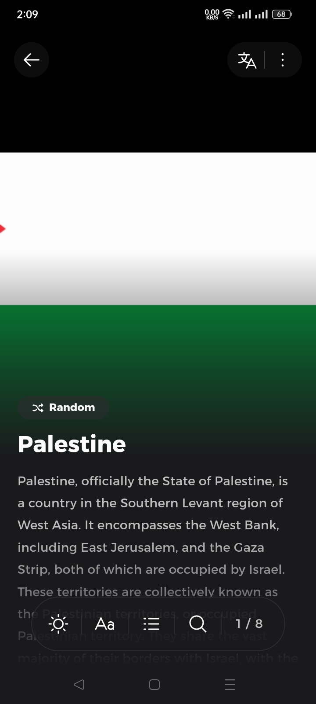
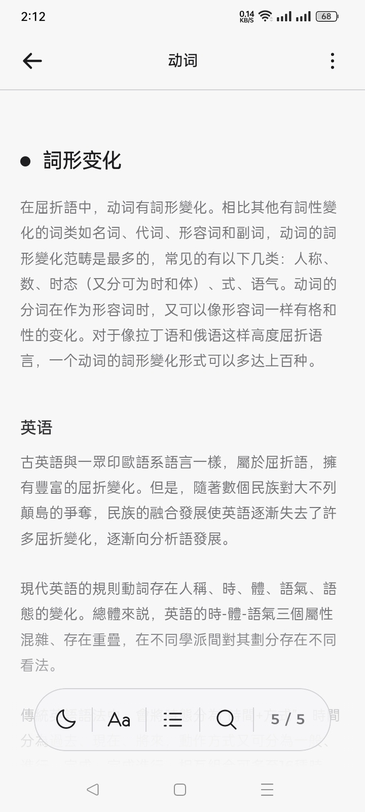
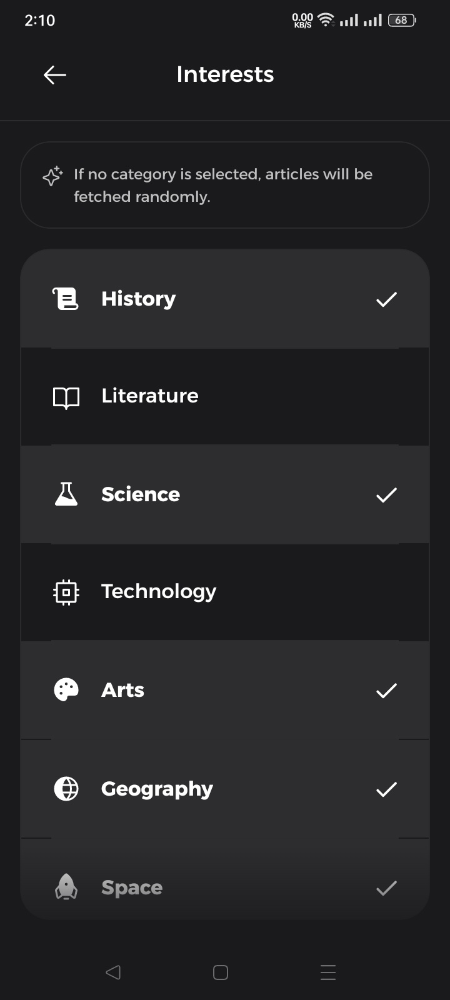
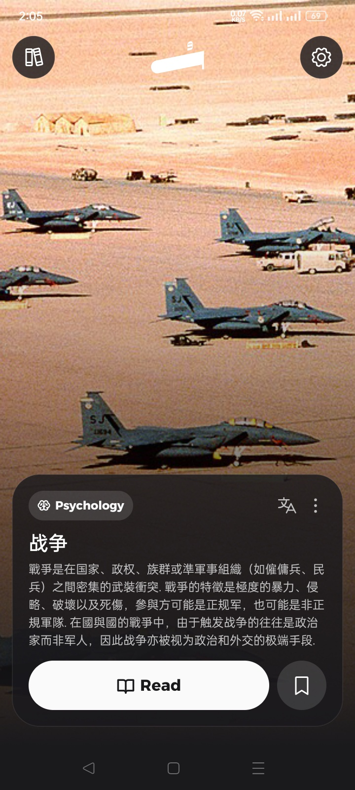
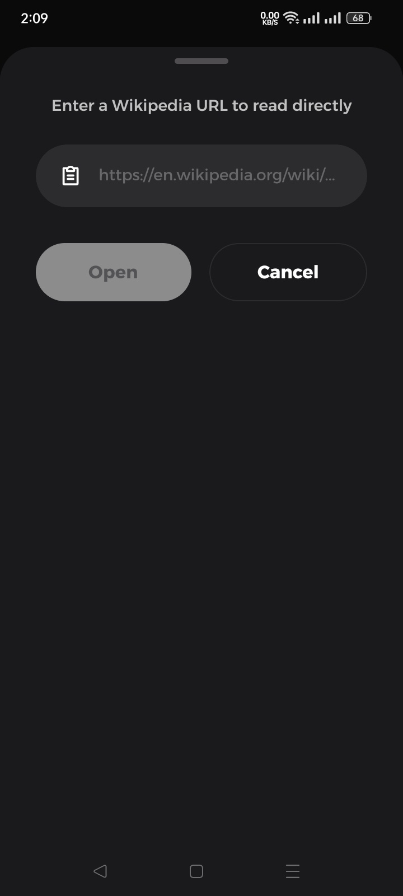
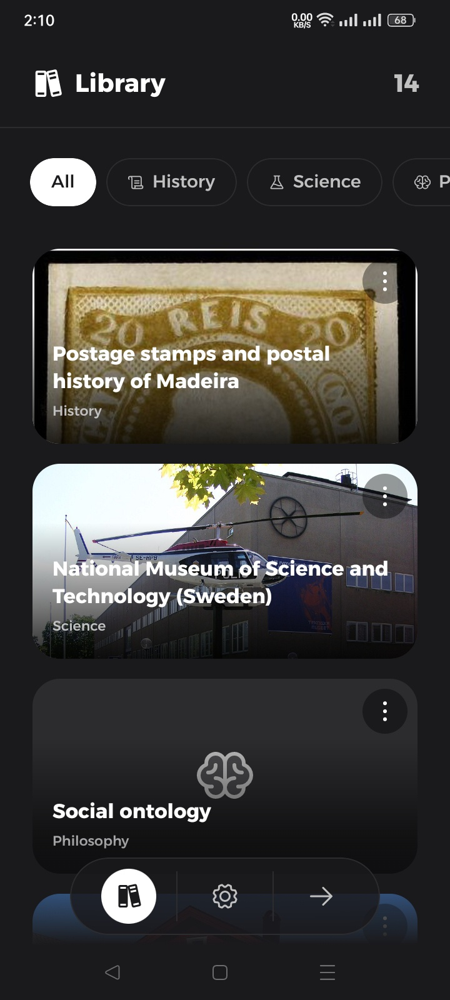
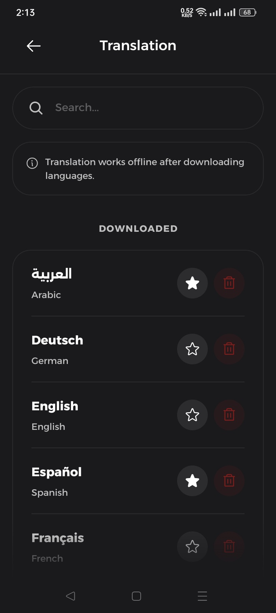
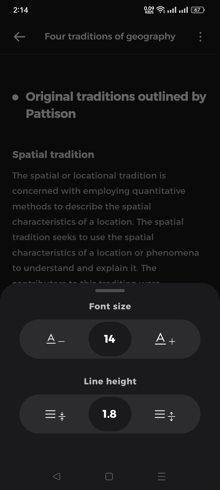

# Soma

**A modern Wikipedia reader featuring a reels-style feed, advanced reading tools, and full offline translation support**

 

English
&nbsp;-&nbsp;
<a href="README-es.md">Español</a>
&nbsp;-&nbsp;
<a href="README-ar.md">العربية</a>

 

 

 

## 👀 Screenshots

  
  
  
  
  
  
  
  
  

 

## ✨ Features

* Browse and discover Wikipedia articles in a modern, vertical scroll format (Reels style).
* Read in a clean and organized interface featuring a horizontal scroll for main section headings.
* Customize your reading experience by adjusting font size and line height, searching inside articles, navigating via the table of contents, and switching between light and dark themes.
* Save articles locally on your device to read them anytime without an internet connection.
* Translate articles into more than 55 languages locally on-device without an internet connection.
* Explore and read Wikipedia articles in over 30 different languages.
* Set your favorite topics and categories to receive personalized article recommendations.
* Open and read any Wikipedia article directly within the app using the dedicated link reader tool.
* Preview images in full resolution, open articles in an external browser, or share them easily.

 

## 🔽 Download

You can download the latest version of the app from the [Releases](https://github.com/you0ssef/SomaApp/releases) page

> [!TIP]
> If you are not sure which version is compatible with your device, please download the **Universal** apk, as it works on all supported devices.

 

## 🐛 Bug Reports & Suggestions

Found a bug or have a suggestion? Please open an **[Issue](https://github.com/you0ssef/SomaApp/issues)**

 

## 📃 License

Soma is a free-to-use application. All rights reserved ©
